## 将安卓手机打造成你的python全栈开发利器

##### 超神利器…


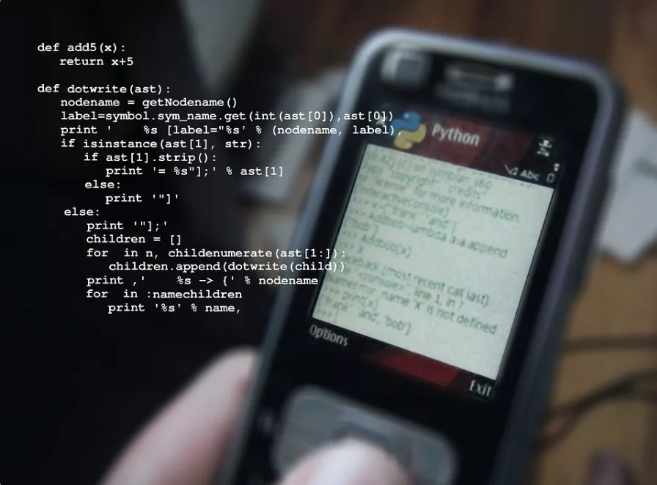相信多数安卓用户都使用过Qpython这款移动端的Python编辑器吧？之前我也研究过一阵子这个工具，但因为一次简单的爬虫让我对它失望之极。Qpython不支持lxml这个模块，然而python中lxml作为最底层的模块，不管是爬虫还是文档解析，都需要使用它。所以，**`Termux`**应运而生….

Termux不仅可以帮助你学习和使用Linux系统，更可以通过安装各种插件，当做我们python全栈开发利器！今天我就带大家了解下，如何在手机上玩转**Python 爬虫**、**jupyter notebook**、**git代码托管**、**Web开发** 等等全套炫酷的功能！

Termux介绍


Termux是一个Android终端的Linux环境仿真器。主要的是它无需root，就可以直接进行安装使用。可以使用apt包管理器或者这个工具推荐的pkg命令来定制安装其他的工具。何为其他工具？Linux下你能想到的工具，都可以去**尝试**，多数都可以直接安装，但也有部分工具需要你转个弯，比如在手机中安装mysql数据库！
Termux的Wiki官网:https://wiki.termux.com/wiki/Main_Page

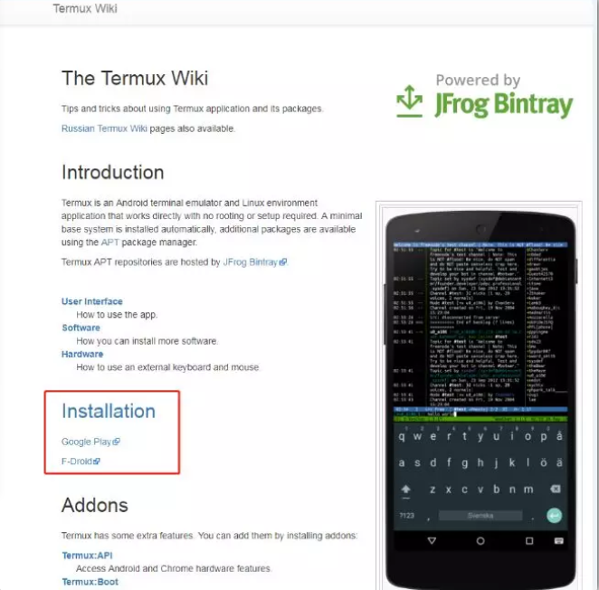ermux的Wiki

官网中可以看到推荐的下载方式是Google Play 和F-Droid。Google Play在手机上安装太麻烦了，所以推荐F-Droid，虽然它比较慢…当然你可以离线下载Termux的apk文件，虽然这样没办法获取更新。安装果果橙比较简单，下载F-Droid，完成安装后搜索Termux，下载即可。

Python开发者桌面


刚才说到Termux的简单介绍与下载方式，那么下载完成，安装的只是这个工具，而非我们的**Python开发者桌面**。Termux安装完成首次进入会进行相关的初始化工作，等待1-2分钟即可(此时需要联网下载工具)。截图如下：

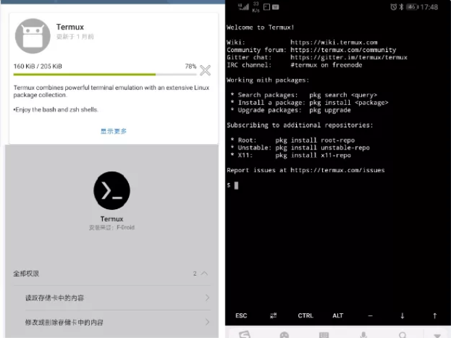安装Termux.png

之后就该进入我们的DIY时间了!

1.

更新源：

为了我们能获取到最新的插件信息，需要更新一下镜像源列表

```
1 pkg update
2 pkg upgrade
3 pkg install python
4 pkg install python python-dev
```

2.

安装python及pip

系统为我们安装了最新的python3.7.4版本，紧追时尚潮流….

```
1 pkg install python python-static
2 pip install --upgrade pip
```

3.

安装依赖插件

这一步阻塞了很长的时间，可以看到网上针对lxml的安装不管是linux系统还是咱们的Termux，都存在这很多的求助帖。

lxml安装报错


按照很多热心网友的回答去尝试安装插件，和其他解决办法，都没有成功。
多数的报错是提示libxml2插件未安装，可明明安装了，之后查阅资料了解python在使用该插件的使用需要通过clang插件的编译后才能使用，但是安装后有提示conv.h的文件无法获取等等。这个问题断断续续卡了我两天你的时间，光卸载安装Termux就搞了几次，每月20G的流量我就剩5G了…最终找齐了所有插件总结给大家：(最新安装依赖详见留言)

```
1 pkg install libxml2 libxml2-dev  libxslt libxslt-dev libiconv libiconv-dev libclang clang libzmq libzmq-dev libc++
2 pkg install libxml2 libxslt libiconv  libllvm clang  libzmq libc++ 
3 pip install lxml
```


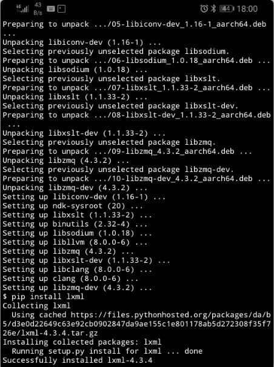lxml安装成功


目录说明


首先我们输入`termux-setup-storage`将手机目录共享给termux，完成后会在home目录下多出一个storage的文件夹。

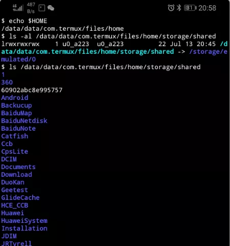目录说明


了解Linux的朋友应该比较清楚创建链接与挂载点的问题,手机的目录在Termux的*/data/data/com.termux/files/home/storage/shared*内。那么同样的，我们可以将手机的代码目录映射到Termux中。命令如下：
`ln -s /data/data/com.termux/files/home/storage/shared/Codes_Repository ~/Codes`
然后，我们将小说下载器的脚本Novels.py丢到手机的Codes_Repository，再去Termux中看看是否同步


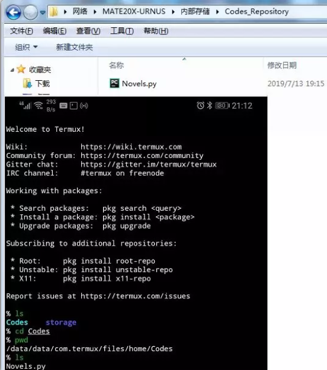目录共享


无意中暴露了我的Mate 20X,哈哈…之所以当时要买7.2英寸的20x就是为了将手机打造成python开发工具。


优化编辑器


大家都知道Linux环境下开发python，大神们都推荐的是vi，用其他的工具都显得不高端…那么如何优化我们的编辑器呢？安装vi的哥哥vim，针对vim下开发python安装vim-python 代码

```
 1 # 安装vim vim-python
 2 pkg install vim vim-python
 3 # 创建vim配置文件
 4 vim .vimrc
 5 # 添加 vim 配置文件
 6 set fileencodings=utf-8,gb2312,gb18030,gbk,ucs-bom,cp936,latin1
 7 set enc=utf8
 8 set fencs=utf8,gbk,gb2312,gb18030
 9 # 保存
10 :wq
11 # 立即生效
12 source .vimrc
```

来看看vim-python的编码效果：

vim-python

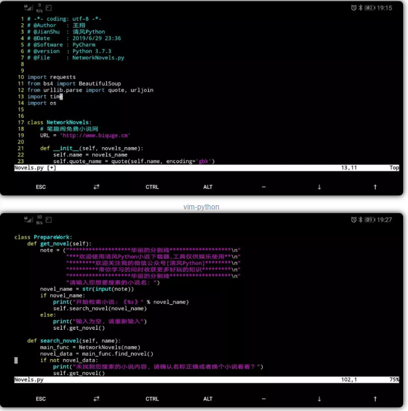

vim-python


手机编程


最后来说说Termux的python开发问题，今天有朋友问到，Termux下写Python代码应该用什么编辑器呢？只用vim没有代码联想，写起来很麻烦…
你可以尝试使用Jupyter Notebook …
如果是按照我之前教程安装的Termux，那么直接*pip install jupyter*即可完成安装…

Termux权限设置


默认情况下Termux安装到手机后，是没有后台运行权限的，即如果你离开Termux桌面，那么将无法继续使用相关的web项目。你需要关闭手机启动管理的自动管理，然后添加上允许后台活动。


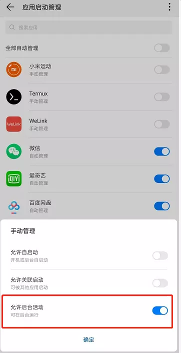Termux设置


之后再输入**`jupyter notebook`**，即可达到后台运行的效果。


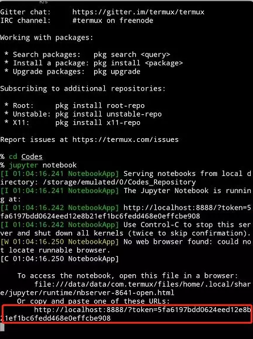jupyter notebook


成功启动jupyter notebook后，会在命令行生成一个带token的url，复制它到你的手机浏览器上，现在在你的手机上好好练习代码吧…

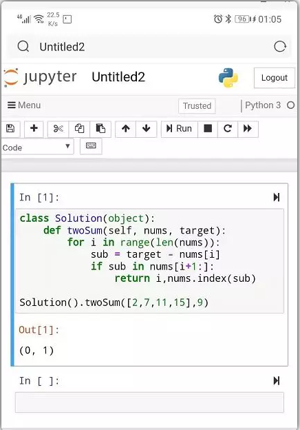代码运行


一道Leetcode上的练习题，在jupyter notebook上运行是不是完美….


爬虫代码运行


怎么样，不管是原生的vim还是大家喜爱的jupyter notebook，展示效果还算不错吧！再让我们执行一段爬虫代码

!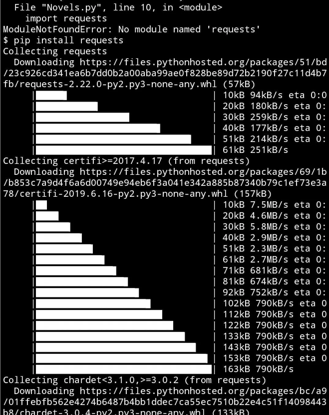模块安装与使用


可以看到，第一次运行提示缺失requests模块，通过pip安装后，再次执行，爬取小说网站，下载了最近5章的小说内容。


Termux下使用git


既然要做成python开发者桌面怎么能少了git工具的使用？

```
1 pkg install git
2 git config --global user.name "Usernam"
3 git config --global user.email  "email-addr"
4 git clone https://github.com/BreezePython/FlaskTests.git
```


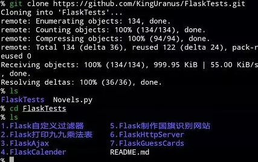Git


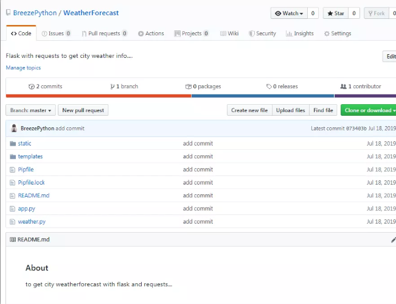


现在我们从手机上下载代码，进行安装…

```
 1 # 如果为安装pipenv，需要先进行安装操作
 2 pip install pipenv
 3 # 克隆代码
 4 git clone https://github.com/BreezePython/WeatherForecast.git
 5 # 进入代码目录
 6 cd WeatherForecast
 7 # 安装虚拟机及依赖模块
 8 pipenv install
 9 # 进入虚拟机
10 pipenv shell
11 # 启动flask
12 flask run
```

因为代码是通过pipenv进行开发的，所以从安装到使用，你无需关注虚拟环境到底涉及什么模块，需要怎么安装，没错pipenv就是这么简单粗暴！放几张图吧：

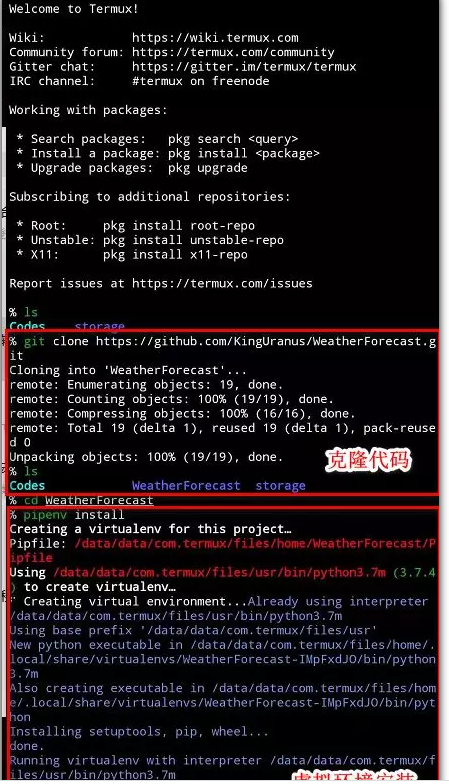下载代码与安装虚拟环境


别说，安装的这个小蛇还挺可爱的….

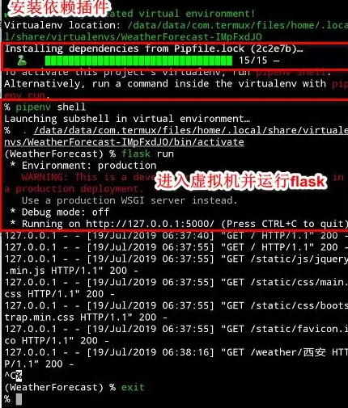安装插件并启动flask